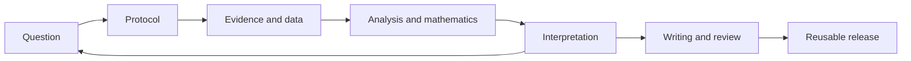

# Open Research

**A small, open-source workbench for everyday research.**

Understand a question. Inspect the evidence and data. Plan a study. Calculate.
Write what the results support. Leave enough behind for someone else to check.

[**Open the interactive guide →**](https://chandrashekhar-hegde.github.io/open-research/)
· [Download the source](https://github.com/Chandrashekhar-Hegde/open-research/archive/refs/heads/main.zip)
· [Daily workflow](docs/daily-workflow.md) · [Tool setup](docs/tool-setup.md)

Open Research brings together a local Python CLI, research skills, study
records, and worked examples. **Lurch** is its optional assistant profile.
Use Claude Code, Codex, OpenCode, another assistant, or just Python and an editor.
The core is offline and has no package dependencies. AI hosts use their own
accounts, models, permissions, and costs; this project does not provide them.

## Start with a real calculation

Install Python 3.11+ and Git, then:

```sh
git clone https://github.com/Chandrashekhar-Hegde/open-research.git
cd open-research
python research.py doctor
python research.py profile examples/paired-measurements/data/raw.csv
python examples/paired-measurements/analyze.py --check
```

Use `python3` if that is your Python command. The example contains eight
**synthetic** pairs; mean change is **2.0 units**. The arithmetic is real, but
there is no empirical population or intervention claim.
[Inspect the complete study](examples/paired-measurements/README.md).

## Pick how you work

| Environment | Setup from this clone | Start |
| --- | --- | --- |
| **Standalone** | Python 3.11+ | `python research.py --help` |
| **Codex** | `python research.py install-skills --tool codex` | `codex` |
| **Claude Code** | `python research.py install-skills --tool claude` | `claude` |
| **OpenCode** | `python research.py install-skills --tool opencode` | `opencode` |
| **Chat-only assistant** | Supply the relevant skill and permitted files | Follow the [chat workflow](docs/tool-setup.md#chat-only-and-other-assistants) |

Install the chosen host separately and authenticate it through its own setup.
Skills are installed only in this project; existing differing files are never
overwritten. [Exact usage, batch commands, prerequisites, and test status](docs/tool-setup.md).

<details>
<summary><strong>Try a first assistant task</strong></summary>

```text
Read AGENTS.md and agents/lurch.md. Inspect the paired-measurements example.
Run its checks, explain what the data can and cannot support, then help me
plan a new study. Record assumptions before starting analysis.
```

For a real task, supply your question and permitted data. The assistant should
use the matching skill, preserve raw inputs, cite evidence, and report unknowns.

</details>

## What do you need to do today?

| Task | Runnable starting point | What you get |
| --- | --- | --- |
| Plan a study | `python research.py init studies/my-study --title "My question"` | Protocol, analysis plan, evidence/claim ledgers |
| Understand data | `python research.py profile data.csv --output build/profile.json` | Shape, missingness, duplicates, descriptive summaries |
| Keep a research log | `python research.py journal studies/my-study --note "Inspected missing values" --next "Decide exclusions"` | Dated local record and next action |
| Draft academic writing | `python research.py draft examples/paired-measurements --output build/manuscript.md` | Evidence-based authoring scaffold |
| Do symbolic math | [Run the mathematics example](examples/mathematics/README.md) | Checked derivatives, integrals, roots, linear algebra |
| Prepare a shareable study | `python research.py check examples/paired-measurements --release` | Structure, evidence-reference and integrity checks |
| Build a research tool | [Small-tool recipe](docs/building-tools.md) | A narrow CLI, regression check, and skill |

A new study is deliberately incomplete until you fill in its metadata and
methods. `profile` describes data; it does not choose a valid design or infer
causation. `draft` assembles recorded claims; it does not write a finished paper.

## A daily research loop



The [daily guide](docs/daily-workflow.md) walks through a research session,
including uncertainty, study changes, and end-of-day handoff. Start small;
not every question needs every tool.

## Use good tools where they already exist

[Jupyter](https://jupyter.org/) for exploration,
[SymPy](https://docs.sympy.org/latest/index.html) for symbolic mathematics,
[SciPy](https://docs.scipy.org/doc/scipy/tutorial/stats.html) for justified statistical methods,
[Zotero](https://www.zotero.org/support/quick_start_guide) for sources, and
[Quarto](https://quarto.org/docs/get-started/) for scholarly publishing.
Open Research connects their artifacts; it does not replace them.
See the [research and design plan](docs/implementation-plan.md).

## Explore the workbench

- [Handbook](docs/README.md): study design, literature reviews, data quality,
  reproducibility, writing, mathematics, security, and open release.
- [Eight research skills](skills/README.md) · [Lurch and task roles](agents/README.md)
- [Study format and CLI](docs/study-format.md) · [Academic document example](examples/academic-writing/README.md)
- [Contributing](CONTRIBUTING.md) · [Governance](GOVERNANCE.md) · [Security](SECURITY.md)

## Check and share

```sh
python scripts/check_repo.py
python -m unittest discover -s tests -v
```

CI checks the offline core on Linux, macOS, and Windows. Math and the static
site have their own checks. Validation identifies specific mechanical problems;
it does not certify scientific quality or independent review.

Open Research follows transparent methods, traceable evidence, reusable
artifacts, and responsible access, informed by
[UNESCO's open science recommendation](https://www.unesco.org/en/open-science/about).
Publish data only when rights and consent allow. Report null results, missing
evidence, protocol deviations, and AI assistance honestly.

[MIT licensed](LICENSE). Copy, adapt, and contribute. Cite the version you used
with [CITATION.cff](CITATION.cff); third-party data and tools retain their own terms.
